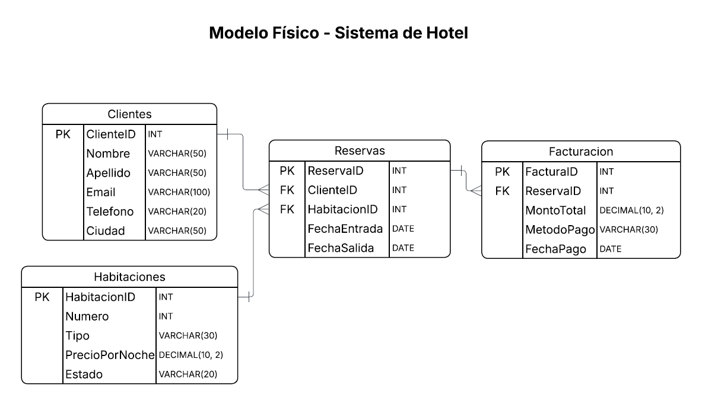
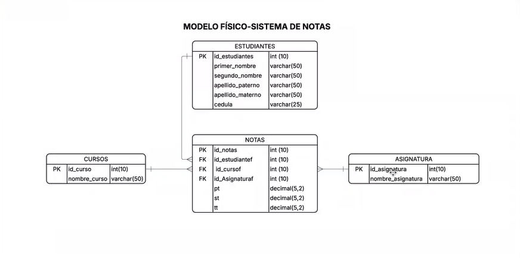

# 📊 SQL & Data Modeling Portfolio

This repository showcases my expertise in **Relational Database Design**, covering the full lifecycle from conceptual and logical schemas to physical implementation in SQL.

## 🏨 Project 1: Hotel Management System
* **Description**: Design of a relational database for hotel operations, featuring at least 4 interconnected tables to manage the full booking and billing cycle.
* **Core Entities**: Customers, Bookings, Rooms, and Billing.
* **Technical Highlight**: Implementation of complex relationships between guest data and transaction records.
* **Physical Model**:

## 🎓 Project 2: Academic Grading System
* **Description**: A comprehensive data model designed to track academic performance and manage institutional records.
* **Included Entities**: Students, Subjects, Courses, and Grades (Notes).
* **Technical Highlight**: Use of normalized tables to ensure data integrity across student enrollments and subject evaluations.
* **Physical Model**:

## 🛠️ Technical Skills
* **Data Modeling**: Entity-Relationship Diagram (ERD) design and physical schema mapping.
* **SQL Engineering**: Scripting for DDL (Data Definition Language) and DML (Data Manipulation Language) using MySQL.
* **Normalization**: Optimizing table structures to reduce redundancy and improve query performance.

---
**Julián Machuca Ramírez** *AI Technologist Student | Lic. in Music Production | [cite_start]B2 English Proficiency* [cite: 94, 106, 143, 171]
